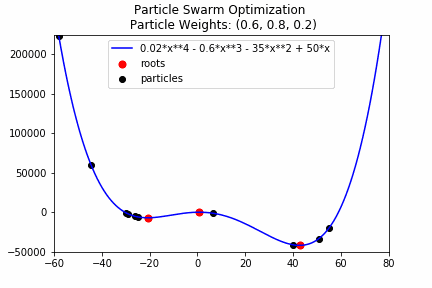
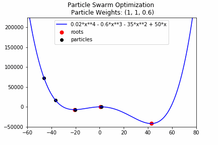
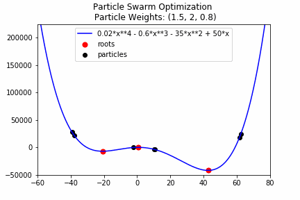

# Optimization Algorithms
My own implementation of various optimization algorithms

## Particlse Swarm Optimization (PSO)
PSO is an algorithm that generates a number of particles (Particle Swarm) in a function space that works together to find the global minimum. 
What makes PSO unique, is that it works on non-differentiable functions. The PSO is a metaheuristic and does not guarantee optimality due to particles being stuck in local minimum values.
A more detailed description can be found on [here](https://en.wikipedia.org/wiki/Particle_swarm_optimization).

Let's see how the implementation works on the function ```0.02x^4 - 0.6x^3 - 35x^2 + 50x```. 







## Differential Evolution (DE)
Differential Evolution (DE) also generates a number of particles at initialization. In DE the particles are mutated, based on the other particles position. The each dimension in the mutated position is then "accepted" with a probability and in the end the new position is compared to the old. If the new position is better, the particle will be updated to this position.


